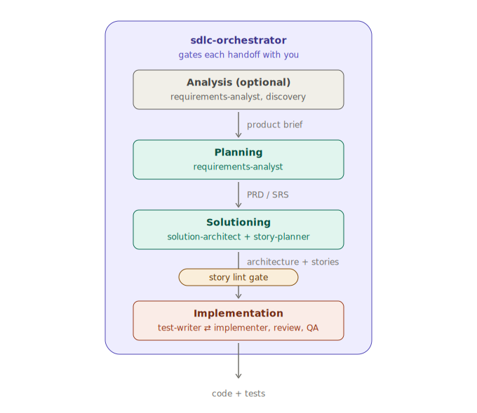
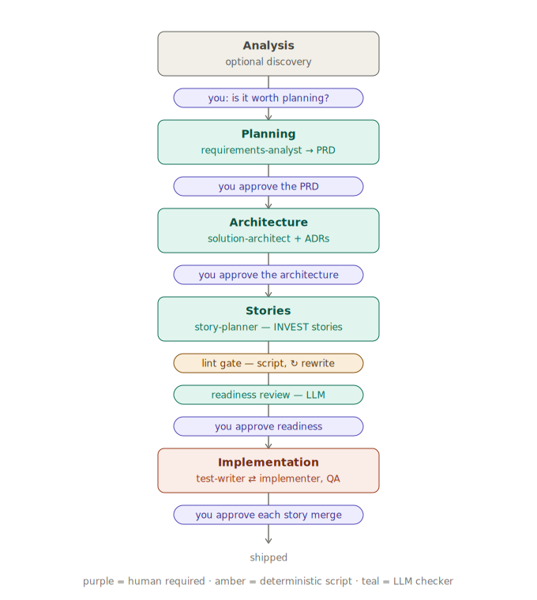

# Using the SDLC Dev Team

A practical playbook for driving a feature from idea to shipped code with the `claude-toolkit` agentic-SDLC team — the skills, the agents, the workflow, and the principles. Designed to live in an Obsidian vault; the `[[links]]` map to the skills/agents in the toolkit.

---

## The cast

**Skills** (the disciplines — knowledge the agents draw on):

| Skill | Owns | One-liner |
|-------|------|-----------|
| [[sdlc-orchestration]] | the pipeline | phases, maker-checker, artifact-driven state, HITL gates |
| [[requirements-engineering]] | the *what* | PRD/SRS, SPEC kernel, measurable NFRs, INVEST stories |
| [[software-architecture]] | the *how (system)* | characteristics, styles & trade-offs, ADRs, C4 |
| [[spec-driven-development]] | spec → work | SPEC kernel, delta specs, self-contained stories, sharding |
| [[test-strategy]] | quality plan | risk-based P0–P3, levels, ATDD, execution-grounded gates |
| [[agentic-workflows]] | runtime mechanics | how to wire the agents (orchestrator-workers, evaluator-optimizer) |

**Agents** (the team — they apply the skills):

| Agent | Role | Produces |
|-------|------|----------|
| [[sdlc-orchestrator]] | Coordinator | sequences the pipeline, delegates, gates handoffs |
| [[requirements-analyst]] | Analyst / PO | PRD/SRS or SPEC |
| [[solution-architect]] | Architect | architecture + ADRs + C4 |
| [[story-planner]] | Tech PO | epics + self-contained, INVEST stories |
| [[qa-test-architect]] | Test architect | test strategy + the (executed) quality gate |
| [[test-writer]] | TDD specialist (RED) | failing tests from acceptance criteria — **test code only** |
| [[implementer]] | Developer (GREEN) | production code that makes them pass — **non-test code only** |

**Supporting cast you already have** (wired in, not duplicated): [[tdd-coach]], [[clean-code-reviewer]], the language reviewers (e.g. [[scala-fp-reviewer]]), [[git-and-ci-reviewer]], [[issue-fixer]]; and supporting skills [[clean-code]], [[software-design]], [[domain-driven-design]], [[event-storming]], [[cqrs-event-sourcing]], [[secure-coding]], [[devops]], [[docker]], [[terraform]], [[github-actions]], [[agent-interoperability]].

---

## The pipeline at a glance

```
        ANALYSIS        →        PLANNING        →        SOLUTIONING        →     IMPLEMENTATION
   (optional discovery)      (what to build)          (how to build it)         (build it, story by story)

   idea / brief        →   PRD / SRS / SPEC    →   the OpenSpec change     →   code + tests → archive
   research notes          (requirements-           proposal → design →         (per story:
                            analyst)                 delta specs → tasks.md      create → dev → review → QA;
                                                     + architecture + ADRs       then openspec archive
                                                     + epics & stories           promotes the specs)
                                                     (orchestrator, solution-
                                                      architect, story-planner)
        └──────────────── orchestrated by sdlc-orchestrator, human approves each gate ─────────────────┘
```



**Artifacts are the handoff.** Each phase reads the previous artifact and produces the next: the PRD tells the architect what matters; the architecture tells the dev which patterns to follow; the story gives one unit of focused context.

---

## How to invoke it (Claude Code)

Once the plugin is installed (`/plugin install claude-toolkit@vezril-toolkit`):

- **Let it delegate.** Describe the work and Claude routes to the right agent by its `description` — e.g. "take this idea through to a plan" pulls in the orchestrator; "write the PRD for X" pulls in the requirements-analyst.
- **Or invoke explicitly.** Ask for an agent by name: *"Use the solution-architect to design this,"* *"Have the qa-test-architect build the test plan and run it."*
- **Skills auto-trigger** on topic (writing a PRD pulls in `requirements-engineering`); you rarely call them directly.
- **One workflow per chat.** Start a **fresh context** for each phase/step and load only that step's artifacts (see Principles). Don't run the whole pipeline in one runaway conversation.

---

## The workflow, step by step

### Phase 1 — Analysis *(optional; skip for small work)*
Explore the problem before writing requirements.
- **Do:** brainstorm, market/domain/technical research, a short **product brief**.
- **Agent:** [[requirements-analyst]] (or just converse).
- **Output:** brief + notes. **Gate:** you understand the problem and it's worth planning.

### Phase 2 — Planning → the requirements artifact *(required)*
Define **what** to build.
- **Agent:** [[requirements-analyst]] — interviews you, quantifies the vague, writes the **PRD/SRS** (or a lightweight **SPEC** for small work).
- **Skill:** [[requirements-engineering]] — the PRD spine (vision, users + jobs-to-be-done, `FR-N` with testable consequences, measurable NFRs, **non-goals**, success metrics **with counter-metrics**), the SPEC kernel, INVEST stories.
- **Output:** `prd.md` / `spec.md` with stable IDs. **Gate:** every requirement is testable, measurable, ID'd, non-goals explicit — and **you approve**.

### Phase 3 — Solutioning → the OpenSpec change (architecture + specs + stories) *(required)*
Define **how**, inside an **OpenSpec change** — the phase's artifact container.


1. **Open the change** — [[sdlc-orchestrator]]: `openspec new change <feature>`, then `proposal.md` — the what/why **distilled** from the PRD (sequence-and-state work; the change artifacts *distill and reference* the PRD/HLD, never fork them). → `openspec/changes/<feature>/proposal.md`.
2. **Architecture** — [[solution-architect]] (skill [[software-architecture]]): derive the driving **characteristics** (≤ ~7, measurable) from the NFRs, choose the **least-worst style** (trade-offs, not a "best"), record **ADRs** (context/decision/consequences), risk-storm it, and draw **C4** (Context + Container, as Mermaid in the repo). The system-level `architecture.md` + ADRs stay repo docs; the **change-scoped how** lands in the change's `design.md`, pointing at them.
3. **Specs & stories** — [[story-planner]] (skill [[spec-driven-development]]): build the specs as the change's **delta specs** (`specs/`, Requirement/Scenario format, `ADDED/MODIFIED/REMOVED` against the living `openspec/specs/`), decompose into epics and **self-contained, INVEST stories** — each carrying acceptance criteria and `[Source: …]` references so it can be built in a fresh context — and write `tasks.md`, the sequenced checklist **referencing** the story files. → `openspec/changes/<feature>/specs/`, `tasks.md`, `stories/`.
4. **Readiness check** — layered. **Layer zero is deterministic, twice over:** `scripts/lint-story.py` validates every story against the normative schema (title/status/statement structure, Given/When/Then grammar, task↔AC mapping closure, `[Source:]` references that actually resolve, FR/CAP traceability), and `openspec validate <feature>` validates the change artifacts. A failure from **either** **short-circuits the gate and bounces the work back to the story-planner for rewrite**, before any LLM review runs (a missing openspec CLI blocks the gate — it never passes by absence). Then the substance review verifies PRD + architecture + specs + stories align. **Gate:** both validators clean + PASS/CONCERNS/FAIL — and **you approve** before any code.


> Greenfield and brownfield take the **same path** now: the living specs in `openspec/specs/` are the baseline (empty on day one), and every change is expressed as deltas against them — the [[spec-driven-development]] OpenSpec approach, promoted from brownfield option to the standard route.

### Phase 4 — Implementation → build it, story by story *(required)*
Work one story at a time through a tight cycle:
```
create story → red (test-writer) ⇄ green (implementer) → execution-grounded review → (QA) → next story → (epic done → retrospective) → openspec archive
```

Implementation drives the change's `tasks.md`; each task points at its story file.


- **Dev (the pair):** [[test-writer]] writes one failing test — it may touch **test code only** — then [[implementer]] writes the minimum production code to pass and refactors — it may touch **non-test code only**. They ping-pong until the story's acceptance criteria are covered. The file boundary is the point: tests can't be bent to fit the code, and code can't edit its own spec. If a test needs a production seam, the test-writer *requests* it from the implementer; if a test looks wrong, the implementer *reports* it back — neither crosses the line. The boundary isn't just charter: the plugin's `PreToolUse` hook (`hooks/enforce-dev-pair-boundary.py`) inspects the calling agent and **denies** any Edit/Write outside its territory (test paths/naming conventions classify the file). ([[tdd-coach]] remains the solo alternative for informal pairing.) Language reviewers ([[scala-fp-reviewer]], etc.), [[clean-code-reviewer]], and [[secure-coding]] keep quality up.
- **QA:** [[qa-test-architect]] (skill [[test-strategy]]) sets risk-based priorities (P0–P3), turns acceptance criteria into tests (ATDD), and **runs the suite + measures coverage** — the gate is a green run, not an opinion.
- **CI/release:** [[git-and-ci-reviewer]] + [[github-actions]]; ship onto infra via [[docker]] / [[terraform]].
- **Gate:** tests pass, coverage meets the P0/P1 map, review clean — and **you approve** the merge.
- **Close-out:** after the last story ships, **you trigger `openspec archive <feature>`** — it promotes the change's delta specs into the living `openspec/specs/`, which accumulate as the system's source of truth. Never automatic; the orchestrator names it and waits.

---

## Pick the track (match weight to the work)

| Track | When | Process |
|-------|------|---------|
| **Quick** | bug fix / small feature | a one-page SPEC + dev; skip phases 1–3 |
| **Standard** | a product/feature | PRD → architecture → stories → dev |
| **Enterprise** | compliance / multi-tenant | add security ([[secure-coding]]) + ops/IaC ([[terraform]], [[devops]]) artifacts |

Don't run the heavyweight pipeline on a typo; don't vibe-code a platform.

---

## The principles that make it work

1. **Artifacts drive state, not chat history.** "Where are we?" = which files exist. Makes the process resumable and stateless.
2. **Required steps block progress.** No skipping PRD → architecture → stories → dev on non-trivial work.
3. **Fresh context per workflow.** One phase per conversation; **shard** large docs and load only the relevant section.
4. **Separate, stronger model for validation.** Validation/readiness checks use a different model than the generator — avoids self-confirmation bias.
5. **Human-in-the-loop at every gate.** Agents propose; you dispose.
6. **Lock the *what* before the *how*.** Requirements/SPEC precede architecture and code.
7. **Execute, don't opine.** Every quality gate runs the code/tests/`terraform plan` — a review that doesn't execute is a guess. *(This is the deliberate upgrade over the source frameworks.)*

**Where you come in** — the purple pills are the mandatory human approvals; everything between them runs on its own (amber = deterministic script, teal = LLM checker). On the standard track a feature costs you 4 + N approvals (N = story count) plus the final `openspec archive` close-out, plus escalations (exhausted rewrite loops, disputed tests, CONCERNS verdicts):



---

## A worked example (standard track)

> *"Add two-factor authentication to the app."*

1. **Plan** — [[requirements-analyst]]: PRD with `FR: TOTP 2FA`, NFR `auth p95 < 200ms`, non-goal "no SMS 2FA", success metric "% accounts with 2FA" + counter-metric "login success rate must not drop". *You approve.*
2. **Open the change** — [[sdlc-orchestrator]]: `openspec new change add-2fa`; `proposal.md` distills the PRD's what/why.
3. **Architect** — [[solution-architect]]: characteristics = security + usability + performance; decision recorded as an ADR ("TOTP via authenticator app; secrets crypto-sharded"); C4 container diagram updated; the change's `design.md` carries the 2FA-scoped how and points at the ADR. *You approve.*
4. **Specs & stories** — [[story-planner]]: delta specs (`specs/auth/spec.md`: `ADDED Requirement: TOTP second factor` with Given/When/Then scenarios); stories `Enable 2FA`, `Verify TOTP at login`, `Recovery codes` — each INVEST, referenced from `tasks.md`. `lint-story.py` + `openspec validate` both pass. *You approve readiness.*
5. **Build** — per story off `tasks.md`: [[test-writer]] turns the acceptance criteria into failing tests; [[implementer]] writes the production code that passes them; [[secure-coding]] checks the secret handling; [[qa-test-architect]] marks login/verify as **P0**, turns the acceptance criteria into tests, and **runs them + coverage**. [[git-and-ci-reviewer]] checks the PR/workflow. *You approve the merge.*
6. **Close out** — *you trigger* `openspec archive add-2fa`: the auth delta becomes part of the living `openspec/specs/auth/spec.md`.

---

## Cheat sheet

- **Start:** *"Use the sdlc-orchestrator to take `<idea>` through the pipeline."*
- **Just requirements:** *"requirements-analyst: write the PRD for `<X>`."*
- **Just architecture:** *"solution-architect: design `<X>` and record ADRs."*
- **Open the change:** *"sdlc-orchestrator: open the OpenSpec change for `<feature>` and distill the PRD into its proposal."*
- **Break into work:** *"story-planner: build the delta specs and turn the PRD + architecture into stories + tasks.md."*
- **Test plan + gate:** *"qa-test-architect: build the test strategy and run the gate."*
- **Build a story:** *"test-writer: turn story `<N>`'s acceptance criteria into failing tests"* → *"implementer: make them pass."*
- **Close a feature:** `openspec archive <feature>` (you trigger it; promotes the deltas into the living specs).
- **Always:** fresh chat per phase · approve each gate · artifacts in the repo · gates that actually run.

---

*Source: the `claude-toolkit` agentic-SDLC skills & agents (built from BMAD, Richards & Ford's *Fundamentals of Software Architecture*, Anthropic's "Building Effective Agents" + Claude Agent SDK, OpenSpec, and Chris Richardson's microservices.io). See `docs/sdlc-agent-team-proposal.md` for the design rationale.*
